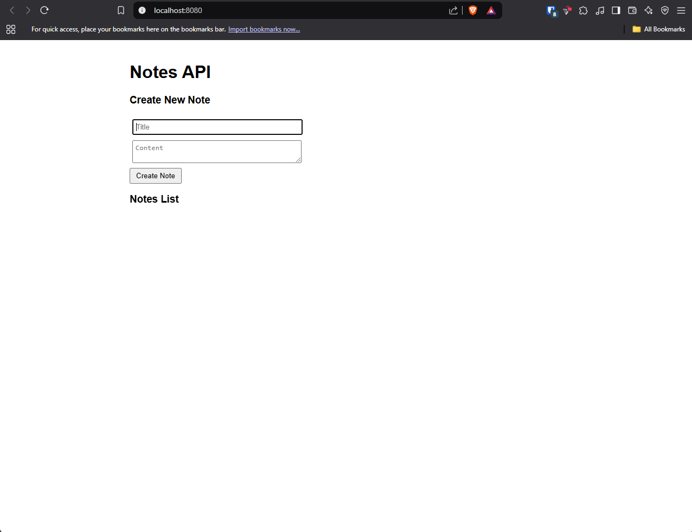
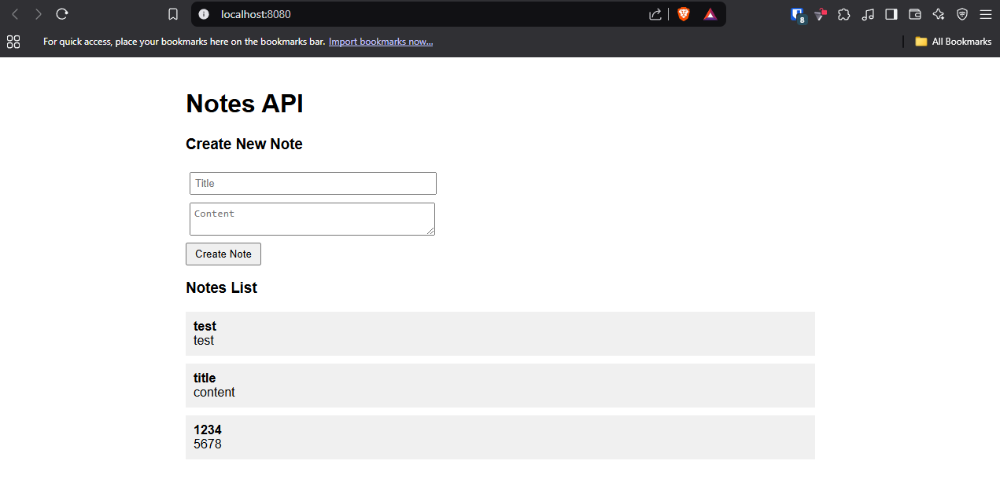
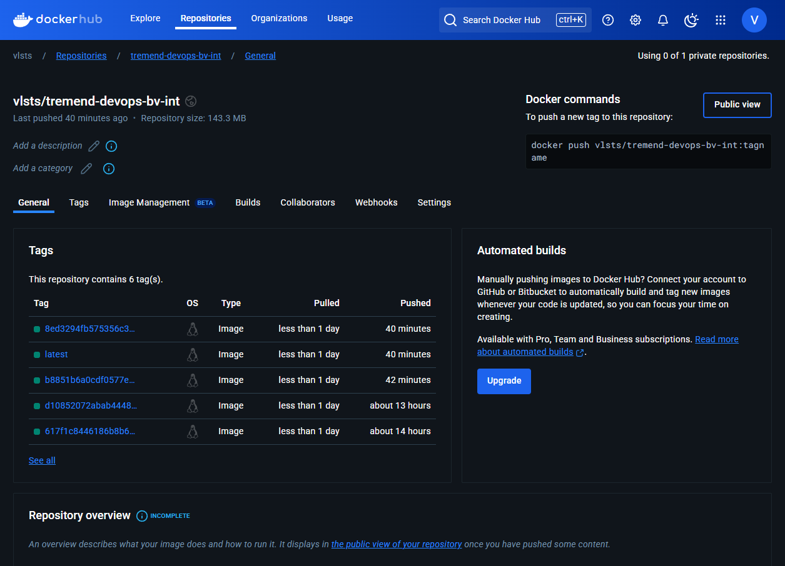
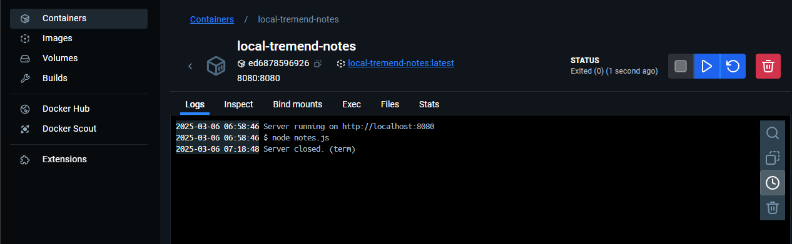
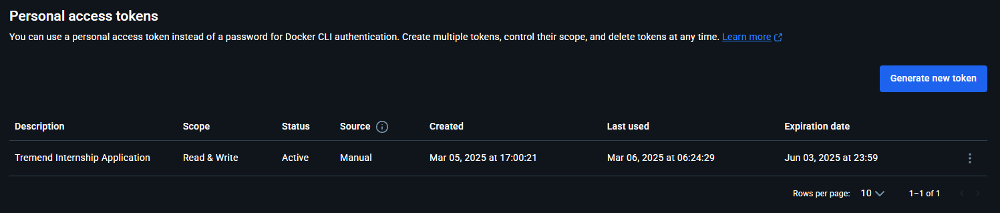
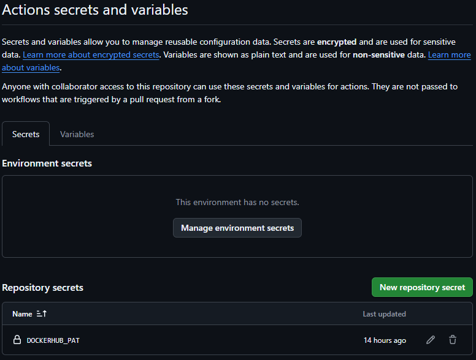

# 🐳 DevOps Exercise 2: Docker

## ⚠️🤓 General mentions
- For this exercise I chose the `node.js` application.
- The `express` package was missing from the dependencies in `package.json`, I added it to the provided files.
- In the Dockerfile you will see `oven/bun:alpine` used as the base image. This image provides [bun](https://bun.sh/), an alternative package manager to `npm` and an alternative runtime to `node.js`. This was used only as a package manager due to the speed provided by it compared to `npm`, at the moment `bun` is not a fully Node-compatible runtime so the application will still run using node.js.
- The `alpine` version was chosen to compact the image (size wise) as much as possible.

## ➕ Create a Dockerfile
The Dockerfile is available [here](./Dockerfile). Comments have been provided in the file for all or most of the steps.

### ⚠️ Ensure the application runs on port 8080
In order to solve this I changed the port in [app/notes.js](./app/notes.js) from `3000` to `8080`.

## 🧪 Local testing
In order to test the image we will start by building it:

```sh
docker build -t local-tremend-notes:latest . # this should be run in the directory that Dockerfile is in
```

```sh
[+] Building 1.0s (10/10) FINISHED                                                                                                        docker:desktop-linux
 => [internal] load build definition from Dockerfile                                                                                                      0.0s
 => => transferring dockerfile: 183B                                                                                                                      0.0s 
 => [internal] load metadata for docker.io/oven/bun:alpine                                                                                                0.7s 
 => [internal] load .dockerignore                                                                                                                         0.0s
 => => transferring context: 75B                                                                                                                          0.0s 
 => [1/5] FROM docker.io/oven/bun:alpine@sha256:66169513f6c6c653b207a4f198695a3a9750ed0ae7b1088d4a8fc09a3a0d41dc                                          0.0s 
 => => resolve docker.io/oven/bun:alpine@sha256:66169513f6c6c653b207a4f198695a3a9750ed0ae7b1088d4a8fc09a3a0d41dc                                          0.0s 
 => [internal] load build context                                                                                                                         0.0s 
 => => transferring context: 125B                                                                                                                         0.0s 
 => CACHED [2/5] WORKDIR /app                                                                                                                             0.0s 
 => CACHED [3/5] COPY ./app .                                                                                                                             0.0s 
 => CACHED [4/5] RUN apk --no-cache add nodejs                                                                                                            0.0s 
 => CACHED [5/5] RUN bun i                                                                                                                                0.0s 
 => exporting to image                                                                                                                                    0.1s 
 => => exporting layers                                                                                                                                   0.0s 
 => => exporting manifest sha256:da7145738fabb929ea6586858b065719761392e12a8692d3777785c2b014e029                                                         0.0s 
 => => exporting config sha256:e12913d604a47ded18770e57eeaee5163d7313fb8a6ab278ff946d23accdef89                                                           0.0s 
 => => exporting attestation manifest sha256:6b5f1748299cdf28fea9bfdfe5ce1f6f5ac99b20888d516ed1568a6019a6c67b                                             0.0s 
 => => exporting manifest list sha256:8a3db50fa7feedc1340c1d0379fbd403acd24e46ab2900631b3e4057e83157c5                                                    0.0s
 => => naming to docker.io/library/local-tremend-notes:latest                                                                                             0.0s
 => => unpacking to docker.io/library/local-tremend-notes:latest                                                                                          0.0s 

View build details: docker-desktop://dashboard/build/desktop-linux/desktop-linux/024ahsi0isv3ajs6jbx9jd6lq
```

After building the docker image we observe no errors so we can try and run it.

```sh
docker run --name local-tremend-notes -d -p 8080:8080 local-tremend-notes:latest # -d to detach from the current console
```

This should start the application and make it available at port `8080` on the host machine.



After fiddling with the app for a bit it seems to be working properly.



## Set up a Docker Registry
The docker registry is available [here](https://hub.docker.com/r/vlsts/tremend-devops-bv-int).



## ⚙️ GitHub Actions Automation
The GitHub Actions workflow is available [here](../.github/workflows/build_docker.yml). Comments have been provided to explain what happens inside the file. You can find all the runs in the [actions tab](https://github.com/vlsts/tremend-devops-bv-int/actions).

## 🎁 Bonus Exercises

### 🛑 Catching Docker's stop signal

We can achieve this by handling the `SIGTERM` signal (according to the Docker [docs](https://docs.docker.com/reference/cli/docker/container/stop/)) in the notes app. Additionally the `SIGINT` signal can be handled for situations in which the user `Ctrl+C`s the program.

At the end of the notes app I wrote this snippet of code:

```js
const server = app.listen(PORT, () => {
    console.log(`Server running on http://localhost:${PORT}`);
});

// docker default signal
process.on('SIGTERM', () => {
    server.close(() => {
        console.log('Server closed. (term)');
    });
});

// ctrl+c signal
process.on('SIGINT', () => {
    server.close(() => {
        console.log('Server closed. (int)');
    });
});
```

This saves the `Server` returned by `listen()` into a constant and then waits for the `SIGTERM` and `SIGINT` signals, closes the server and prints a message to the console.



### 🔑 Configuring environment variables for sensitive information

The application itself does not expose sensitive information but in order to publish the image to DockerHub we need to store a DockerHub Personal Access Token. The token can be obtained [here](https://app.docker.com/settings/personal-access-tokens). This token was saved as a secret to then be used by GitHub Actions. (`secrets.DOCKERHUB_PAT`)


