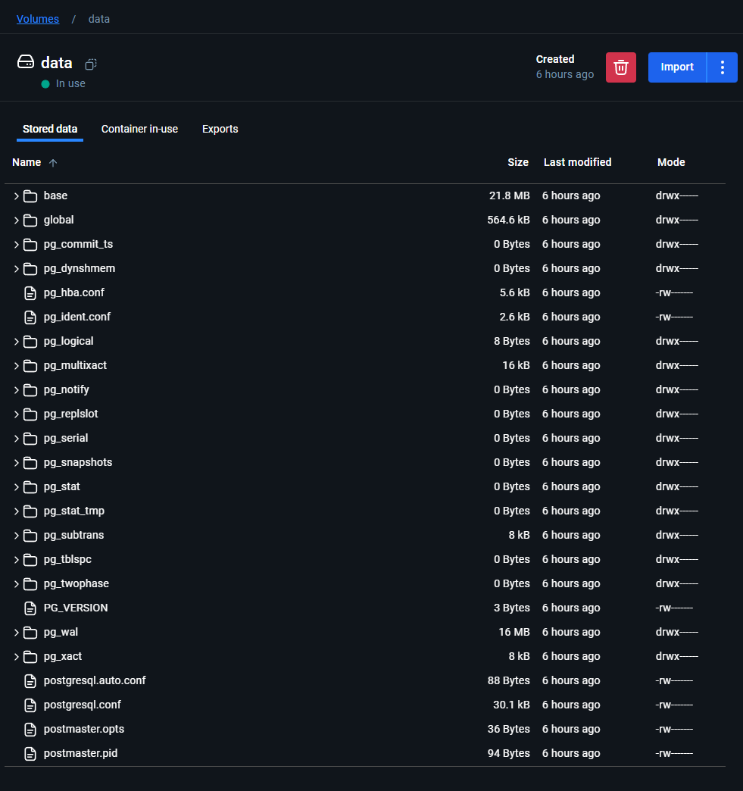
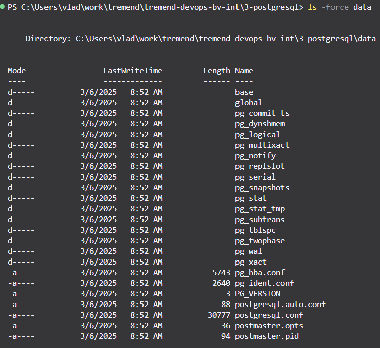

# 📅 DevOps Exercise 3: PostgreSQL

## ⚠️🤓 General mentions

- The initial SQL file had to be corrected (corrected version available [here](./populatedb.sql))
    - `USE company_db;` is not available in PostgreSQL
    - In the final insert there are invalid entries, those with IDs from 54 to 76

```sql
select max(employee_id), count(*) from employees;
```

| max | count |
|:---:|:-----:|
| 53  |  53   |

`(1 row)`

## 🐳 Pull and run a PostgreSQL container

This can be done with a `docker run` command:

```sh
# POSTGRES_PASSWORD is needed to run the container
docker run --name postgresdb \
  -e POSTGRES_PASSWORD=password \
  -p 5432:5432 \
  -d postgres
```

### 📅 Create a database called "company_db", use "tremend" user

```sh
psql -U postgres
```

```sql
CREATE USER tremend WITH password 'tremend';
ALTER USER tremend CREATEDB;
```

```sh
psql -U tremend -d postgres
```

```sql
CREATE DATABASE "company_db";
```

This can also be done by changing the docker environment variables of the container to rename the default database user according to the docs on DockerHub.

## 📅 Create a dataset using the sql script provided in the folder `3-db/`

```sh
psql -U tremend -d company_db < ./populatedb.sql
```

## 🔎 SQL Queries

### 🤵 Find the total number of employees
```sql
SELECT count(*) FROM employees;
```

|  count  |
|:-------:|
|    53   |

`(1 row)`

### 🤵 Retrieve the names of employees in a specific department (prompt for user input)

I assume that the prompt should be in the bash script but PostgreSQL does have `\prompt`, this query uses it.

```sql
\prompt 'Enter department name: ' department

SELECT e.employee_id, e.first_name, e.last_name, d.department_name
FROM employees e
-- A departments join is needed because the employees table does not have the department name, only the ID
JOIN departments d ON e.department_id = d.department_id
-- Specific syntax for using the \prompt command.
WHERE d.department_name = :'department';
```

| employee_id | first_name | last_name | department_name |
|:-----------:|:----------:|:---------:|:---------------:|
| 6           | Bob        | Johnson   | IT              |
| 7           | Charlie    | Brown     | IT              |
| 8           | Hannah     | Martinez  | IT              |
| 9           | Noah       | Lewis     | IT              |
| 10          | Liam       | Clark     | IT              |
| 11          | Emma       | Davis     | IT              |
| 12          | Olivia     | Taylor    | IT              |
| 13          | Lucas      | Baker     | IT              |
| 14          | Ava        | Evans     | IT              |
| 15          | William    | Nelson    | IT              |

`(10 rows)`

### 🧮 Calculate the highest and lowest salaries per department

```sql
SELECT 
    d.department_name as "Department",
    MIN(s.salary) AS "Lowest Salary",
    MAX(s.salary) AS "Highest Salary"
FROM employees e
JOIN salaries s ON e.employee_id = s.employee_id
JOIN departments d ON e.department_id = d.department_id
GROUP BY d.department_name
ORDER BY d.department_name;
```

|    Department    | Lowest Salary | Highest Salary|
|:----------------:|:-------------:|:-------------:|
| Customer Support |     109000.00 |      119000.00|
| Finance          |      62000.00 |       76000.00|
| HR               |      50000.00 |       60000.00|
| IT               |      67000.00 |       94000.00|
| Legal            |      91000.00 |      143000.00|
| Marketing        |      78000.00 |       91000.00|
| Operations       |     121000.00 |      131000.00|
| Sales            |      93000.00 |      107000.00|

### 📩 Dump the dataset into a file

Dumping of the database can be done using pg_dump by mentioning the connection details and piping the output to a file. [dbdump.sql](./dbdump.sql) is the generated dump for the database. `--no-owner` is needed because the dumped file will expect the user to be the same as the one it was dumped from when reimported which is not the case for this task.

```sh
pg_dump -U tremend --no-owner company_db > ./dbdump.sql
```

### ⌨️ Bash script for automation
The bash script is available [here](./automate.sh). Comments have been left through the code for clarity. The outputs to the queries are in the `logs` folder.

| Query outputs                                                         |
| :-------------------------------------------------------------------: |
| [Employee Count](./logs/employee_count.log)                           |
| [Employees in Department](./logs/employees_query.log)                 |
| [Highest / Lowest Salaries per Department](./logs/salary_query.log)   | 

The output for this script is similar to the following:

```sh
PostgreSQL Database Automation Script
Enter database host (default: localhost): 192.168.1.56 # ran from Ubuntu WSL, had to use local ip to target Windows machine
Enter PostgreSQL password:
Enter database name: test_db
Enter path to SQL dump file: ./dbdump.sql
Creating admin user ps_cee...
Enter password for admin user ps_cee:
CREATE ROLE
Creating database test_db...
Importing SQL dump from ./dbdump.sql...

... # SQL outputs

Executing SQL queries...
Running Query 1: Total number of employees
Table list saved to logs/employee_count.log
Running Query 2: Retrieve the names of employees in a specific department
Enter department name for query: IT
Department query results saved to logs/employees_query.log
Running Query 3: Calculate the highest and lowest salaries per department
Salary query results saved to logs/salary_query.log
Database setup completed successfully!
```

The database looks like this after the script runs:


|    Name    |  Owner   | Encoding | Locale Provider |  Collate   |   Ctype    | Locale | ICU Rules |     Access privileges     |
|:----------:|:--------:|:--------:|:---------------:|:----------:|:----------:|:------:|:---------:|:-------------------------:|
| company_db | tremend  | UTF8     | libc            | en_US.utf8 | en_US.utf8 |        |           |                           |
| postgres   | postgres | UTF8     | libc            | en_US.utf8 | en_US.utf8 |        |           |                           |
| template0  | postgres | UTF8     | libc            | en_US.utf8 | en_US.utf8 |        |           | =c/postgres          +    |
|            |          |          |                 |            |            |        |           | postgres=CTc/postgres     |
| template1  | postgres | UTF8     | libc            | en_US.utf8 | en_US.utf8 |        |           | =c/postgres          +    |
|            |          |          |                 |            |            |        |           | postgres=CTc/postgres     |
| test_db    | ps_cee   | UTF8     | libc            | en_US.utf8 | en_US.utf8 |        |           |                           |

## 🎁 Bonus Exercises

### 💾 Mount a persistent volume to store PostgreSQL data

This can be done by binding a volume to `/var/lib/postgresql/data` when running the image. The volume can be:
- 🐳 Docker managed: `-v data:/var/lib/postgresql/data` where `data` is the name of the volume
```sh
docker run --name postgresdb \
  -e POSTGRES_PASSWORD=password \
  -v data:/var/lib/postgresql/data \
  -p 5432:5432 \
  -d postgres
```



- 🖥️ Available on the host machine: `-v ./data:/var/lib/postgresql/data` where `./data` is the path on the host machine where the data should be stored
```sh
docker run --name postgresdb \
  -e POSTGRES_PASSWORD=password \
  # or .\data for Windows
  -v ./data:/var/lib/postgresql/data \
  -p 5432:5432 \
  -d postgres
```

